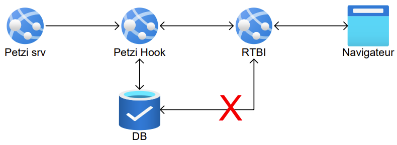

# Projet Petzi

## Description
Petzi est une application développée pour le traitement et la visualisation en temps réel des données de ventes de billets de concert. Permet aux gestionnaires d'événements de suivre les ventes en temps réel et d'optimiser les stratégies de marketing et de distribution.

## Architecture
Le projet est composé de plusieurs modules :
- `PetziHook` : un serveur Spring Boot qui gère les webhooks.
- `RTBI` : un module de traitement en temps réel des informations et qui notifie les clients via SSE.
- `Dashboard` : un tableau de bord pour la visualisation des données.
- `Common` : une librairie partagée entre les différents modules.

## Prérequis
- Java JDK 21 ou supérieur.
- Maven pour la gestion des dépendances et le build des projets.
- Docker pour la gestion du conteneur Kafka.

## Installation et Configuration Globale
1. **Clonage du projet** : Utilisez `git clone https://github.com/Jonathanngamboe/petzi` pour cloner le projet sur votre machine locale.
2. **Docker** : Avant de démarrer les applications, assurez-vous que les services Docker sont en cours d'exécution. Utilisez `docker-compose up` dans le répertoire Docker pour démarrer les services Kafka.
3. **Base de données** : Configurez la base de données H2 du module `PetziHook` avec les paramètres corrects dans `application.properties` si nécessaire ou utilisez les paramètres par défaut.

### Modules
Chaque module peut être démarré individuellement en exécutant leur classe `main`. Par exemple, pour `PetziHook`, lancez `PetziHookApplication.java`. Cependant, les modules doivent être démarrés dans un ordre spécifique pour que l'application fonctionne correctement :
1. `PetziHook` (Nécessite Docker. Pour plus d'informations, consultez le README du module)
2. `RTBI`
3. `Dashboard`

## Utilisation
Consultez les README spécifiques de chaque module pour des instructions détaillées sur leur utilisation.

## Contact
- Dev : Jonathan Ngamboe
- E-mail : jonathan.ngamboe@he-arc.ch

---
